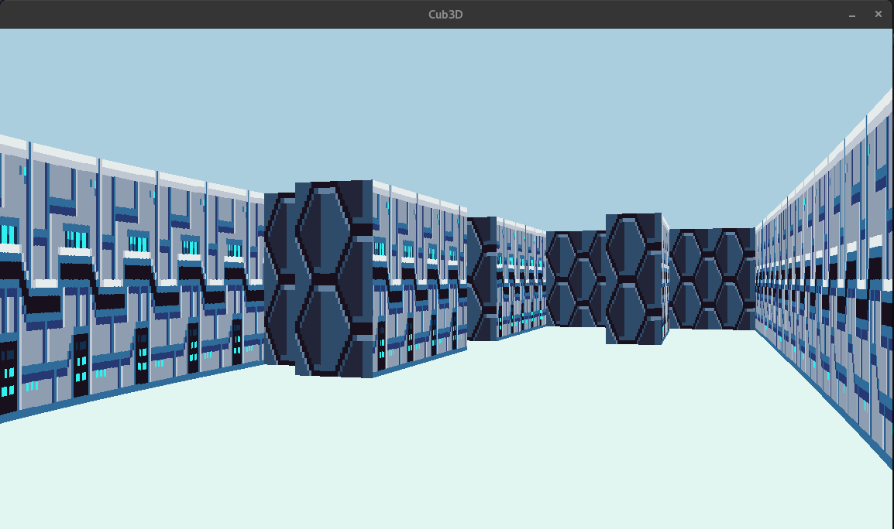
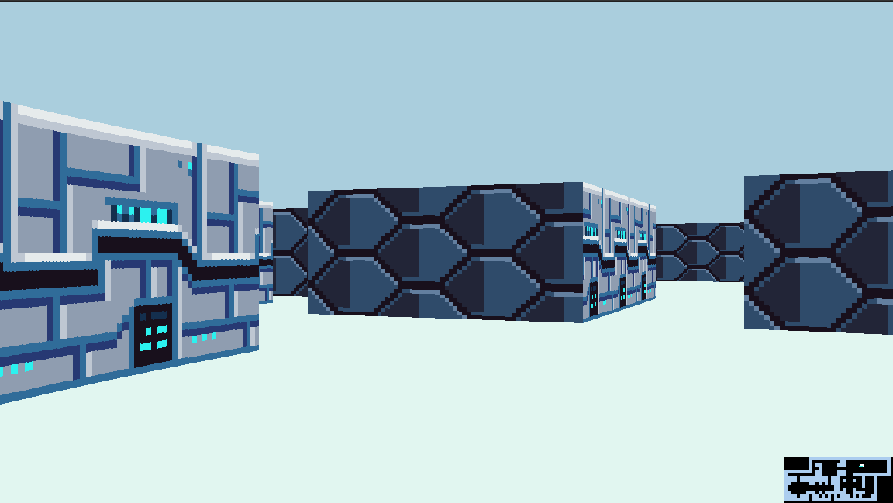

# cub3D: A RayCaster with miniLibX

## Introduction
cub3D is a project inspired by the world-famous **Wolfenstein 3D**, which is widely considered the first "First Person Shooter" in video game history.
Developed as part of the **42 school** curriculum, this project explores the technical implementation **in C** of a raycasting engine to create a dynamic 3D perspective within a maze from a subjective first-person view.
The primary goal is to apply practical mathematics and basic algorithms in C to build a functional graphical engine using the miniLibX library.


This project has been validated with a score of **110/100.**


&nbsp;

## The project




### Mandatory Requirements

- **Dynamic 3D Rendering:** Uses raycasting principles to project a 2D map into a 3D environment.
- **Directional Texturing:** Displays different textures based on which side of the wall is hit (North, South, East, or West).
**Customizable Environment:** Supports specific floor and ceiling colors via RGB values defined in the configuration file.
- **Fluid Movement:** W, A, S, D keys for player movement through the maze; left and Right arrow keys for camera rotation.
- **Clean Window Management:** Handles window minimization, switching, and closing seamlessly
- **Robust Parsing:** Validates *.cub* scene description files, ensuring maps are properly enclosed by walls and all identifiers are correct

### Bonus Features
The project includes a separate bonus build *(make bonus)* which adds:
- **Minimap:** A 2D top-down view of the maze and player position.
- **Wall Collisions:** Prevents the player from walking through walls.

&nbsp;

## Technical Infrastructure

### Project Architecture

The project is structured into several modular directories for clarity and maintainability:

```srcs/parsing/``` : Logic for reading and validating *.cub* files (textures, colors, and map layout).

```srcs/raycasting/```: The core engine, including ray calculations, horizontal/vertical intersection checks, and 3D projection.

```srcs/libft/```: A customized utility library for string manipulation and data processing.
    
&nbsp;

## Compilation and usage
The project uses a Makefile that follows standard 42 rules, including flags -Wall -Wextra -Werror.
Use ```make``` to compile the mandatory part, and ```make bonus``` for the bonus part.


#### Usage
To launch the program, provide a valid *.cub* scene description file as the first argument:

```bash
./cub3D map/map.cub
```

#### Controls

W: Move Forward
S: Move Backward
A: Move Left
D: Move Right
Left / Right Arrow Keys: Rotate Camera
ESC or Red Cross button: Quit Game


#### Scene Configuration (.cub File)
The configuration file must follow a strict format for the engine to parse it correctly:

**Textures:** NO, SO, WE, EA followed by the path to the texture file (e.g., NO ./path_to_north_texture).

**Colors:** F (Floor) and C (Ceiling) followed by RGB values (e.g., F 220,100,0).
**Map:** Composed of 0 (empty space), 1 (wall), and N/S/E/W for the player's starting position and orientation.

The map must always be at the end of the file and fully enclosed by walls.